# FinanceVM 白皮書 v2.0（中文版）

## 專為金融資產代幣化設計的主權標準合規虛擬機
### 合約即真相——可執行、可認列、可監理

**版本**：v2.0 ｜ **日期**：2026-08-05 ｜ **前版**：v1.0

**AIMICHIA TECHNOLOGY CO., LTD.（艾米佳科技有限公司），GANN-JIUN LIN**

**官方網站**：https://financevm.io/

**Email**：contact@financevm.io ｜ jim.lin@aimichia.com

---

## 1. 執行摘要

### 1.1 FinanceVM 要解決的原始問題

FinanceVM 自設計之初即針對傳統區塊鏈在金融場景的三項結構性缺陷：

| 缺陷 | 問題 |
|---|---|
| **精度風險** | 傳統智能合約缺乏原生高精度十進位運算，金融計算產生不可接受的捨入誤差 |
| **Gas 不效率** | 複雜風險模型（如選擇權定價的蒙地卡羅模擬）於鏈上執行成本高昂且緩慢 |
| **標準脫節** | 代幣由技術介面定義而非金融定義，程式碼與法律／金融現實之間存在斷層 |

v1.0 的解答是四項架構主張：**任意精度算術核心**（零浮點誤差）、**金融物件模型 FOM**（FINOS CDM + ISO 4914）、**主權執行環境**（各機構獨立控制自身實例）、以及**主權節點網路**——明確拒絕「單一世界狀態」模型，改採「主權國家網路」架構。

在此架構下，FinanceVM 已完成十類金融工具的沙盒平台（第 9 節），涵蓋存款、債券、股票、期貨、選擇權、抵押品、大宗商品、交換、年金與保證代幣。

### 1.2 v2.0 延伸的軸線

v2.0 不改變上述主張，而是沿一條軸線向前延伸：**確定性不應止於執行**。

v1.0 確保了「合約如何被計算」的確定性。v2.0 主張同一份合約應同時確定性地導出四件事：

```
                    合約
                     │
   ┌────────┬────────┼────────┬────────┐
   ▼        ▼        ▼        ▼        ▼
  執行     電文     認列     監理     內控
 帳本狀態  ISO20022  帳簿分錄  監理報表  控制觀測
```

由此產生 v2.0 的三項新增能力：

| 能力 | 解決的問題 |
|---|---|
| **合約可驗證溯源** | 鏈上執行邏輯與法律條款之間缺乏密碼學連結 |
| **會計認列互操作性** | 同一資產於不同管轄權被認列為不同科目，財報結果不一致 |
| **設計意圖一致性內控** | 代幣實際行為偏離設計意圖時，各利害關係人無從察覺 |

加上既有的 ACTUS、ISO 20022、vLEI、BCBS SCO 60、PQC 五項標準模組，與新整合的 **FEK 合規控制模組**，構成 v2.0 的完整能力集。

### 1.3 與產業互操作性框架的關係

2026 年 2 月，DTCC、Clearstream、Euroclear 與 Boston Consulting Group 共同發布《Building the Path Towards Digital Asset Securities Interoperability》，將數位資產證券互操作性拆解為 29 個建構區塊，並提出定義：*同一資產、同一權利、同一結果*。

**須說明時序**：FinanceVM 原型與 v1.0 白皮書均早於該報告發布。本文引用該框架，並非因其提出了新問題，而是因為它以產業共識的形式，獨立收斂到與 FinanceVM 相同的技術判斷——特別是其對「網路之網路」的主張，與 v1.0 的主權節點網路架構高度一致。

本文以該框架作為**能力對照的公用尺規**，理由有二：它由三大 CSD 共同定義，具備跨機構的溝通效率；且其 0–4 分證據制提供了可驗證的自評基準。

同時，本文指出該框架在其自身定義的邏輯終點前停止了，並提出三個補充建構區塊（#30 認列、#31 溯源、#32 內控），詳見第 6、7、8 節。

---

## 2. 問題陳述：確定性在何處中斷

### 2.1 三個中斷點

FinanceVM 的核心命題是**確定性**——相同輸入必然產生相同輸出，且該輸出可被第三方獨立重現。v1.0 在計算層達成此目標。但確定性在三處中斷：

**中斷一：合約與程式碼之間。** 智能合約由人工撰寫並部署，不存在機制證明鏈上執行邏輯忠實對應法律合約條款。一旦分歧，計算再精確也無意義——精確地計算了錯誤的合約。

**中斷二：執行與認列之間。** 一筆代幣化債券於 A 管轄權被認列為金融工具、以攤銷後成本衡量，於 B 管轄權被認列為無形資產、以成本模式衡量並須做減損測試。結算層完全一致，財報層完全不一致。

**中斷三：設計與觀測之間。** 代幣被設計為具備特定的轉讓限制、生命週期行為與風險特徵。但在實際流通中——特別是二級市場——各利害關係人（發行人、承銷人、參加人、交易對手、監理單位、第三方機構、投資人）各自只能看見片段，無人能判斷代幣當前狀態是否仍在設計意圖之內。

### 2.2 共同成因

三個中斷有同一個成因：**缺少一個位於法律／商業意圖與帳本執行之間、可計算且確定性的中介表述**。

FinanceVM 以兩個互補的標準構成此中介表述：

| 標準 | 角色 | 回答的問題 |
|---|---|---|
| **FOM**（FINOS CDM + ISO 4914 UPI + 識別碼群） | 表述層 | 這是什麼工具？ |
| **BPoS**（ISO 21586） | 意圖層 | 這個產品／服務應該如何運作？誰在何處負責？ |
| **ACTUS** | 計算層 | 這份合約在存續期間會產生什麼？ |

三者分工明確：FOM 定義**身分**，BPoS 定義**設計意圖與控制點**，ACTUS 定義**確定性行為**。三者共同構成 v2.0 的中介表述層。

---

## 3. 架構

### 3.1 模組關聯


**圖 1｜FinanceVM 模組關聯**

三條關鍵路徑值得指出：

1. **精度核心支撐全部計算**。ACTUS 現金流、SCO 60 指標、會計分錄皆依賴任意精度算術。任一環節退回浮點運算，整條確定性鏈即失效。
2. **ACTUS 是唯一的分流點**。電文、分錄、監理指標、智能合約四者皆由同一份現金流事件序列導出，因此天然一致——不需要事後對帳。
3. **BPoS 同時流向 ACTUS 與內控觀測模組**。前者是設計意圖轉為可計算行為，後者是以設計意圖為基準比對實際觀測。同一份 BPoS 描述既是規格也是控制基準。

### 3.2 分層架構


**圖 2｜FinanceVM 分層架構**

三項設計約束：

1. **基礎層與核心層零外部依賴**。值物件不可變且自我驗證，狀態機不依賴任何基礎設施。
2. **FEK 為守門人，不持有狀態**。核心層在提交任何狀態變更前呼叫 FEK；FEK 不得反向呼叫核心層的變更介面。
3. **FEK 的 L0–L3 是控制關卡順序，非架構深度**。此為與分層架構正交的另一維度，詳見附錄 A。

### 3.3 主權節點網路

v1.0 確立的立場——以「主權國家網路」取代「單一世界狀態」——在 v2.0 維持不變，並獲得新的技術基礎。

各主權節點由其營運者（銀行、資產管理機構、CSD）獨立控制，可依當地監理要求啟動、停止或暫停。節點之間不共享全域狀態，因此不存在單一故障點，亦不存在跨管轄權的狀態強制同步問題。

v1.0 未完全回答的問題是：**若各節點不共享狀態，靠什麼保持一致？** 第 5 節的合約定錨機制即為此問題的解答。

---

## 4. FEK 合規控制模組

### 4.1 定位

FEK（Financial Execution Kernel）是資產無關的合規控制功能，由四個可獨立部署的控制關卡加一條橫切稽核軌跡構成。每一筆代幣化資產交易，自發起至結算，均通過同一套標準對齊的檢查。

| 關卡 | 職責 | 標準依據 |
|---|---|---|
| L0 | 機構身分的密碼學驗證 | ISO 17442-3（KERI/ACDC via GLEIF） |
| L1 | 鏈上轉讓規則強制執行 | ERC-3643 + ONCHAINID |
| L2 | 電文組裝、XSD 驗證、vLEI 簽章 | ISO 20022 |
| L3 | 生命週期現金流監控與斷路器 | ACTUS |
| ✕ | 僅可追加、雜湊鏈接的稽核軌跡（橫切） | — |

FEK 具備兩種封裝形態：**獨立部署**（自帶 HTTP 閘道）與**嵌入部署**（FinanceVM 以函式庫引入）。兩者共用同一份程式碼。

### 4.2 關卡介面與可插拔設計

四個關卡共用單一介面契約，替換實作僅需以相同 `GateID` 註冊不同實作，呼叫端零改動。


**圖 3｜FEK 關卡介面與實作類別圖**

合規政策引擎為 FEK 的橫切元件，四個關卡共用同一套政策規則，避免合規邏輯散落。

### 4.3 平行評估

L0、L1、L3 彼此獨立，僅 L2（電文組裝需簽章身分）依賴 L0。關卡以有向無環圖排程，可平行評估：

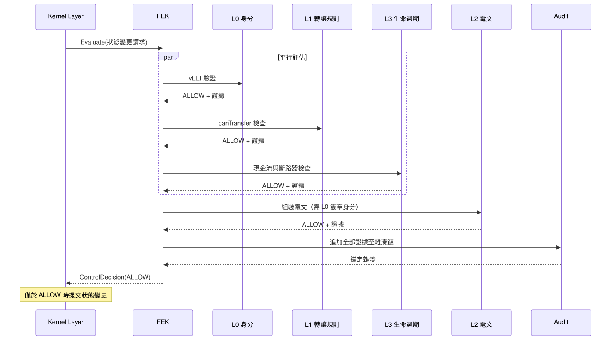

**圖 4｜FEK 平行關卡評估時序**

任一關卡回傳 DENY 即短路終止，但已抵達的關卡證據仍完整寫入稽核軌跡，確保拒絕原因可被事後審查與爭議解決引用。

### 4.4 可互換矩陣

| 關卡 | 預設實作 | 可替換實作 | 適用情境 |
|---|---|---|---|
| **L0 身分** | vLEI / KERI / ACDC | X.509 + eIDAS 憑證 | 尚未採用 vLEI 之歐盟機構 |
| | | ONCHAINID 單獨使用 | 純鏈上輕量部署 |
| | | Canton Party ID | Canton Network 部署 |
| | | 國家級 eID / 工商憑證 | 本地監理要求 |
| **L1 轉讓規則** | ERC-3643 + ONCHAINID | ERC-1400 | 既有 ERC-1400 資產 |
| | | Daml controller + choice | Canton，協議層強制 |
| | | Hedera HTS KYC/Freeze Key | Hedera 部署 |
| | | Stellar SEP-8 Regulated Assets | Stellar 部署 |
| **L2 電文** | ISO 20022 | FpML | 場外衍生商品 |
| | | FIX | 交易前與執行階段 |
| | | FINOS CDM | 擔保品與衍生商品工作流 |
| **L3 生命週期** | **ACTUS** | **刻意不提供替代實作** | 見 4.5 |
| **Audit** | SHA-256 雜湊鏈 | + ML-DSA-65 簽章 | 量子安全存證需求 |
| | | + 公鏈錨定 | 第三方時間戳需求 |

### 4.5 L3 為何刻意鎖定

L0、L1、L2 的替換屬**部署選配**；L3 不同，它是**溯源錨點**。

第 7 節將說明，「鏈上執行邏輯可密碼學證明源自某個已簽章的 ACTUS 條款版本」是合約溯源的全部基礎。若 L3 可替換，此證明鏈即斷裂——不同部署可能採用不同的生命週期語義。

因此 L3 保留 `Gate` 介面以維持架構一致性，但於 FinanceVM 合規部署設定檔中鎖定 ACTUS 實作。替換 L3 須明示為降級並於自評中扣分。**此處的「刻意不可替換」是設計立場，非能力限制。**

---

## 5. 合約定錨的跨帳本同步

### 5.1 主權節點網路的一致性問題

主權節點網路架構明確拒絕全域共享狀態。此立場帶來獨立性與監理可控性，但留下一個必須回答的問題：各節點若不共享狀態，靠什麼保持一致？

傳統解答是跨鏈橋——但 N 個帳本兩兩對帳需要 N(N−1)/2 組對帳關係，每組各自須處理最終性差異、時間差與格式差。這既複雜又脆弱，且引入包裝資產的雙重計算風險。

### 5.2 以確定性錨點取代兩兩對帳


**圖 5｜合約定錨的跨帳本同步**

**核心主張：帳本之間不互相對帳，而是各自對同一個確定性錨點對帳。**

這正是主權節點網路所需的一致性機制——它不要求節點共享狀態，只要求各節點對同一份已簽章的合約條款負責。主權性因此得以保留。

### 5.3 三項效益

| 效益 | 說明 |
|---|---|
| 複雜度由 O(N²) 降為 O(N) | 新增一個主權節點的邊際成本為常數 |
| 權益認定改用**合約時間**而非牆鐘時間 | ACTUS 事件排程由合約定義，不依賴任何帳本的區塊時間 |
| 無包裝代幣，因此無雙重計算 | 不存在被包裝的資產 |

第二項值得展開。典型痛點是「代幣化軌道近乎即時、傳統軌道遵循批次時程，導致權益在不同時刻被認定」。在合約時間下此問題不成立：票息歸屬由 ACTUS 的 record date 決定，各帳本何時**觀測到**該事件不影響歸屬結果。觀測延遲成為對帳議題，而非權益議題。

### 5.4 邊界聲明

| | 可解決 |
|:---:|---|
| ✅ | 跨帳本權益一致性 |
| ✅ | 跨帳本條款一致性 |
| ✅ | 跨帳本對帳（各自對錨點） |
| ✅ | 合約溯源 |
| ❌ | **跨帳本價值移轉的原子性** |
| ❌ | 跨帳本資產位置唯一性的強制 |

合約定錨解決權益與條款的一致性，**不提供跨帳本的原子價值交換**。於本參考實作中，原子式 DvP 於單一許可鏈（Hyperledger Besu）內達成。

**跨帳本原子結算為主動緩議項目**，待各管轄權監理機關對公鏈參與提出更明確方向後再行實作。此為監理判斷，非技術限制——在監理立場未定前建構跨鏈橋，將使平台營運者落入「須跨管轄權許可的市場機構」範疇，實質改變平台的監理定位。

---

## 6. 建構區塊 #30：會計認列互操作性

### 6.1 準則現況與架構意涵

國際會計準則理事會（IASB）尚未承諾制定獨立的加密資產準則，而是計畫更新 IAS 38（無形資產）以處理相關議題，其官方工作計畫排定於 2026 下半年；美國財務會計準則委員會（FASB）已啟動加密資產移轉的專案，目標包含擴大 Subtopic 350-60 適用範圍並釐清移轉的除列指引，另有專案探討某些數位資產是否可分類為約當現金。

**此現況對架構設計具決定性意涵：目前不存在可供硬編碼的準則。** 任何將會計科目寫死的系統，於準則落地時皆須重做。

因此，**可設定的映射層並非權宜之計，而是準則未定期間唯一正確的架構**。

### 6.2 虛擬總帳


**圖 6｜虛擬總帳架構**

系統**不決定**分類結果，僅執行使用者設定的映射，並記錄設定的版本與生效期間。

### 6.3 資料模型


**圖 7｜虛擬總帳資料模型**

### 6.4 分類決策範圍

使用者依 (管轄權 × 準則框架 × 資產性質 × 持有目的) 設定分類結果：

| 分類 | 準則依據 | 適用情境 |
|---|---|---|
| 存貨 | IAS 2 | 交易商為出售而持有 |
| 無形資產 | IAS 38 | 現行 IFRS 通行處理 |
| 金融工具 | IFRS 9 | 具債權或權益性質之代幣化證券 |
| 約當現金 | 待準則確認 | 若後續準則採納 |

後續衡量模式同樣可設定：成本模式／重估價模式／FVTPL／攤銷後成本。

### 6.5 規則版本化是審計要求

認列規則集納入合約版本管理（第 7 節）。當準則更新生效時，系統須能證明「2026 年之交易依當時規則認列、2027 年起依新規則認列」，且兩者皆可重現。每一筆分錄記錄其適用的規則集版本 ID，使任何歷史分錄皆可回溯至產生它的規則與 ACTUS 事件。

### 6.6 主張

> 「同一資產、同一權利、同一結果」不應止於結算最終性。若同一筆代幣化證券在不同管轄權下被認列為不同科目、以不同基礎衡量，則**經濟結果並不相同**——互操作性於財務報表層面已然失效。

---

## 7. 建構區塊 #31：合約可驗證溯源

### 7.1 已被要求，未被解決

產業框架的第 19 塊明文包含 **verifiable contract provenance**（可驗證的合約溯源）與 **controlled change**（受控變更）。此要求已被提出，但未說明實現途徑——在通行架構中確實無法實現：智能合約由人工撰寫並部署，鏈上執行邏輯與法律文件之間不存在密碼學連結。

### 7.2 溯源鏈

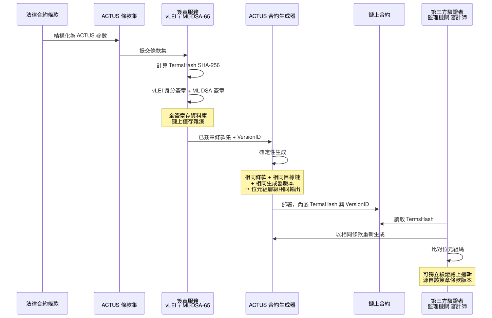

**圖 8｜合約溯源鏈**

### 7.3 版本生命週期


**圖 9｜合約版本狀態機**

版本變更原因分為四類：監理要求、公司結構變更、經濟條款變更、技術升級。監理驅動之版本變更帶有最高優先級。

### 7.4 四項要件

1. **確定性生成**——相同輸入產出位元組層級相同的合約，使第三方可獨立重現並比對。
2. **溯源錨點上鏈**——合約內嵌 TermsHash 與 VersionID。ML-DSA-65 全簽章（3,309 位元組）存於鏈下資料庫，鏈上僅存 SHA-256 雜湊，以管理鏈上儲存成本。
3. **升級權威唯一**——鏈上合約之升級、凍結、退役僅接受 FinanceVM 簽章授權，且每次變更須引用一個已通過 FEK 合規檢查的新條款版本。
4. **跨鏈行為一致性驗證**——同一 ACTUS 條款於不同帳本生成之合約，須通過同一組黃金數字測試。

---

## 8. 建構區塊 #32：設計意圖一致性與多視角內部控制

### 8.1 代幣化缺少的不是技術，是內控

現行代幣化實務將重點置於「代幣能否正確移動」。但對機構而言，一項金融工具進入市場前必須先回答另一組問題：**誰負責什麼？在哪個環節可以攔截？如何知道它偏離了設計？**

這是內部控制的問題，不是技術問題。而在代幣化情境下它更尖銳——代幣一旦進入二級市場流通，發行人對其去向的可見度遠低於傳統證券。

產業框架的 BB7（生命週期角色）、BB11（帳戶角色責任）、BB17（中介責任）、BB22（職責分離）、BB23（資料存取角色）各自涵蓋了此問題的一個切面，但**沒有任何一塊處理「設計意圖與實際狀態的偏離偵測」**。本節提出的建構區塊即為此。

### 8.2 BPoS 作為設計意圖的結構化表述

ISO 21586（BPoS）規範銀行產品與服務的描述方式。FinanceVM 使用 BPoS 的目的超出分類——它是**代幣設計意圖的正式聲明**：

| BPoS 描述的內容 | 在內控中的作用 |
|---|---|
| 產品／服務的構成要素 | 代幣應具備哪些權利與義務 |
| 適用條件與限制 | 轉讓限制、投資人適格性、額度上限 |
| 涉入角色與職責 | 誰是發行人／承銷人／參加人／託管人 |
| 生命週期階段 | 一級市場發行、上市、二級市場流通、到期 |
| 費用與計價結構 | 應收應付的正當範圍 |

一份完整的 BPoS 描述，即是該代幣的**控制基準線**。

### 8.3 多視角狀態可見性


**圖 10｜多視角代幣狀態可見性**

**關鍵設計原則**：七個視角看到的是**同一份狀態的不同投影**，而非七份各自維護的資料。投影由角色權限決定（對應 BB23），但底層事實單一。這消除了傳統架構中「各方帳目不一致」的根源。

### 8.4 非設計風險的偵測

「非設計上的風險」指代幣實際狀態落入設計時未預期的區間。典型類型：

| 偏離類型 | 範例 | 偵測基準 |
|---|---|---|
| 集中度偏離 | 單一持有人超過設計上限 | BPoS 額度限制 |
| 適格性偏離 | 代幣流入非適格投資人帳戶 | BPoS 投資人條件 + FEK L0/L1 |
| 生命週期偏離 | 應付票息未於 ACTUS 排程日發生 | ACTUS 事件排程 |
| 流動性偏離 | 二級市場流通量異常於設計預期 | BPoS 產品特性 |
| 結構偏離 | 鏈上合約版本與 EFFECTIVE 版本不符 | 溯源模組 TermsHash |
| 職責偏離 | 同一實體同時擔任不相容角色 | BPoS 角色定義 + BB22 |


**圖 11｜設計意圖一致性狀態機**

**設計哲學**：偏離不預設為違規。它可能揭示設計本身的缺漏——此時正確的回應是修正 BPoS 描述並產生新的合約版本，而非壓制訊號。此路徑（`DESIGN_AMENDED`）使系統具備學習能力，而非僅具備告警能力。

### 8.5 一級市場與二級市場的差異

| | 一級市場 | 二級市場 |
|---|---|---|
| 主要控制點 | 發行條件、配售適格性、額度 | 轉讓限制、持有人結構、集中度 |
| 可見度來源 | 承銷流程紀錄 | 帳本狀態 + FEK 稽核軌跡 |
| 典型偏離 | 超額配售、非適格認購 | 適格性漂移、集中度累積 |
| 強制手段 | 承銷協議 + FEK L1 | FEK L1 + L3 斷路器 |

二級市場的挑戰在於發行人失去直接可見度。合約定錨機制在此提供關鍵能力：**無論代幣流通至哪個主權節點，其行為皆由同一份 ACTUS 條款界定**，因此偏離偵測不需依賴節點自願回報。

---

## 9. 已完成的沙盒平台與 Besu 重構

### 9.1 v1.0 架構下已完成的十類代幣平台

| 平台 | ACTUS 合約類型 | 代表金融工具 |
|---|---|---|
| 存款代幣 | CSH / UMP | 活期與定期存款 |
| 債券代幣 | PAM / LAM / NAM / ANN | 固定與浮動利率債券 |
| 股票代幣 | STK | 普通股與特別股 |
| 期貨代幣 | FUTUR | 標準化期貨契約 |
| 選擇權代幣 | OPTNS | 買權與賣權 |
| 抵押品代幣 | CEC | 擔保品安排 |
| 大宗商品代幣 | COM | 實體商品部位 |
| SWAP 代幣 | SWAPS / SWPPV | 利率與貨幣交換 |
| 年金代幣 | ANN | 年金給付合約 |
| 保證代幣 | CEG | 信用保證 |

此覆蓋範圍涵蓋 ACTUS 標準的主要合約類型族群，橫跨現金、債權、權益、衍生商品與信用強化五大類。**這是「一核多殼」原則的實證**：同一份 ACTUS 計算核心，經不同封裝即可支撐性質差異極大的金融工具。

### 9.2 兩軌策略

| | Showcase Track | Reference Track |
|---|---|---|
| 版本標示 | `v1.x — Sandbox` | `v2.0 — Reference Implementation` |
| 內容 | 上述十類代幣沙盒平台 | Besu 上重構之平台 |
| 用途 | 展示核心於各類金融工具的可移植性 | 正式合作、監理對話、本文評估標的 |

> **聲明**：FinanceVM 沙盒平台（v1.x）為能力展示產物，用以證明共用核心橫跨十類金融工具的可移植性。**其非本文能力評估之標的**。本文之評估適用於 Hyperledger Besu 上之 FinanceVM Reference Implementation（v2.0）。十類平台將依序以 Besu 架構重構。

### 9.3 部署架構


**圖 12｜Besu 參考實作部署架構**

公鏈的角色維持 v1.0 立場不變：**僅供透明性與稽核錨定，不承載資產狀態**。

### 9.4 重構順序的兩項不可妥協前置

| 序 | 項目 | 為何必須在此位置 |
|:---:|---|---|
| 1 | 帳戶／錢包統一模型 | Position、Instrument、稽核軌跡皆須引用 AccountID |
| 2 | 資料隱私分類標記 | 哪些欄位為 PII、哪些不上鏈，屬 schema 決策 |
| 3 | 所有權層級模型 | 帳戶模型之必要補完 |
| 4 | Foundation + Kernel 重建 | 精度核心、值物件、狀態機、CFEP |
| 5 | FEK 整合 | 四關卡 + 政策引擎 + 稽核 |
| 6 | 合約溯源模組 | BB#31 |
| 7 | 合約版本管理 | 與第 6 項共用 TermsHash，必須成對 |
| 8 | 會計認列模組 | BB#30 |
| 9 | 內控觀測模組 | BB#32 |

第 1、2 項必須先於第 4 項。此二者為 schema 層決策，一旦核心層建立且資料開始上鏈，改動成本即由「數週」變為「重做」。

### 9.5 帳戶模型


**圖 13｜帳戶與所有權層級模型**

無 Omnibus、Nominee、Trust 帳戶之等效能力，既有投資載體無法進入 DLT 平台，流動性直接受損。

---

## 10. 標準覆蓋

### 10.1 識別與參考資料標準

| 標準 | 內容 | 模組 |
|---|---|---|
| ISO 6166:2021 | ISIN 國際證券識別碼 | FOM |
| ISO 4914:2021 | UPI 唯一產品識別碼 | FOM |
| ISO 23897:2020 | UTI 唯一交易識別碼 | FOM |
| ISO 18774:2024 | FISN 金融工具簡稱 | FOM |
| ISO 24165 | DTI 數位代幣識別碼 | FOM |
| ISO 10962:2021 | CFI 金融工具分類 | FOM |
| ISO 20275:2017 | ELF 實體法律形式 | FOM |
| **ISO 21586:2020** | **BPoS 銀行產品與服務描述** | **BPoS 模組（內控基準）** |
| ISO 17442-3 | vLEI 可驗證法人識別 | vLEI |
| FINOS CDM | 共同領域模型 | FOM |

九項識別碼標準均含校驗位演算法實作。

### 10.2 執行、電文與密碼標準

| 標準 | 模組 |
|---|---|
| ACTUS | ACTUS 模組——金融合約計算，統一底層 |
| ISO 20022 | ISO 20022 模組——全電文目錄 |
| ERC-3643 + ONCHAINID | FEK L1 預設實作 |
| NIST FIPS 203 (ML-KEM-768) | PQC 模組——後量子金鑰封裝 |
| NIST FIPS 204 (ML-DSA-65) | PQC 模組——後量子數位簽章 |
| BCBS SCO 60 | BCBS SCO 60 模組——LCR / NSFR |

**關於後量子密碼的宣稱範圍**：本模組已實作 FIPS 203/204 演算法，惟尚未取得認證。在認證完成前，本文不宣稱後量子合規，僅陳述演算法實作狀態。

---

## 11. 評估方法論與承諾

本文**不呈現數值化的能力自評分數**。

FinanceVM Reference Implementation 正處於重構階段。對一個即將被取代的架構給出分數，將產生誤導。

重構完成後，我們將依產業框架所定義之 0–4 分制，對全部 **32 個建構區塊**發布完整自評，並提供各分數級距所要求之證據：

| 分數 | 標籤 | 所需證據 |
|:---:|---|---|
| 0 | Not Addressed | — |
| 1 | Partially Addressed | 內部討論文件或初步設計草圖 |
| 2 | Planned | 已核准之專案計畫、架構文件或路線圖項目 |
| 3 | Implemented | 可運作之程式碼、已部署服務或作業流程文件 |
| 4 | Verified & Compliant | 測試報告、稽核結果、監理核准或業界認證 |

---

## 12. 路線圖

| 狀態 | 項目 |
|:---:|---|
| **已交付** | 精度核心（任意精度算術，零浮點誤差） |
| | ACTUS 模組（生產階段） |
| | ISO 20022 模組（生產階段） |
| | vLEI 模組，GLEIF 測試鏈運作中 |
| | BCBS SCO 60 模組（生產階段） |
| | PQC 模組（待認證） |
| | FEK 模組 |
| | 十類金融工具沙盒平台 |
| **進行中** | Besu 參考實作重構 |
| | 帳戶／錢包統一模型、資料隱私分類 |
| | FEK 可插拔關卡介面 |
| **已規劃** | 合約溯源模組（#31） |
| | 會計認列模組（#30） |
| | 內控觀測模組（#32） |
| | 合約版本管理 |
| | Canton Network / Daml 整合 |
| **主動緩議** | 跨帳本原子結算——待各管轄權對公鏈參與提出明確監理方向 |

---

## 附錄 A：層級模型對照

FEK 的 L0–L3 與 FinanceVM 的分層是**兩個正交的維度**：

| 維度 | 性質 | 序列意義 |
|---|---|---|
| FinanceVM 具名層 | 架構分層 | 依賴方向（上層依賴下層） |
| FEK L0–L3 | 控制關卡 | 執行順序（身分→轉讓→電文→生命週期） |


**圖 14｜兩個正交維度的對照**

---

## 附錄 B：v1.0 至 v2.0 的變更

| 面向 | v1.0 | v2.0 |
|---|---|---|
| 精度核心 | 已確立 | 不變 |
| 主權執行環境 | 已確立 | 不變 |
| 主權節點網路 | 已確立立場 | **補上一致性機制（合約定錨）** |
| FOM | FINOS CDM + ISO 4914 | 擴充至九項識別碼標準 |
| 稽核層 | 公鏈僅供錨定 | 不變 |
| BPoS | 分類用途 | **升級為內控基準線（#32）** |
| 合規控制 | 分散於各模組 | **整合為 FEK 模組** |
| 會計認列 | 未涵蓋 | **新增（#30）** |
| 合約溯源 | 未涵蓋 | **新增（#31）** |
| 節點間通訊 | Model Context Protocol | Inter-Node Settlement Protocol（見附錄 C） |

---

## 附錄 C：命名事項

v1.0 使用「Model Context Protocol（MCP）」指稱主權節點間的通訊協定。此名稱現已被廣泛用於另一項無關的 AI 工具協定，於 2026 年的讀者可能產生誤解。v2.0 改用不致混淆之名稱「 **Inter-Node Settlement Protocol（INSP）**」。

---

## 附錄 D：圖表索引

| 圖 | 名稱 | 類型 | 節次 |
|:---:|---|---|:---:|
| 1 | FinanceVM 模組關聯 | 元件圖 | 3.1 |
| 2 | FinanceVM 分層架構 | 元件圖 | 3.2 |
| 3 | FEK 關卡介面與實作 | 類別圖 | 4.2 |
| 4 | FEK 平行關卡評估 | 時序圖 | 4.3 |
| 5 | 合約定錨的跨帳本同步 | 流程圖 | 5.2 |
| 6 | 虛擬總帳架構 | 流程圖 | 6.2 |
| 7 | 虛擬總帳資料模型 | 類別圖 | 6.3 |
| 8 | 合約溯源鏈 | 時序圖 | 7.2 |
| 9 | 合約版本狀態機 | 狀態圖 | 7.3 |
| 10 | 多視角代幣狀態可見性 | 流程圖 | 8.3 |
| 11 | 設計意圖一致性狀態機 | 狀態圖 | 8.4 |
| 12 | Besu 參考實作部署架構 | 部署圖 | 9.3 |
| 13 | 帳戶與所有權層級模型 | 類別圖 | 9.5 |
| 14 | 兩個正交維度的對照 | 對照圖 | 附錄 A |

---


