# FinanceVM Whitepaper v2.0

## A Sovereign, Standard-Compliant Virtual Machine for Financial Asset Tokenisation
### The Contract as Single Source of Truth: Execution, Recognition, Supervision

**Version**: v2.0 ｜ **Date**: 5 August 2026 ｜ **Supersedes**: v1.0

**AIMICHIA TECHNOLOGY CO., LTD., GANN-JIUN LIN**

**Website**: https://financevm.io/

**Email**: contact@financevm.io ｜ jim.lin@aimichia.com

---

## 1. Executive Summary

### 1.1 The Problems FinanceVM Was Built to Solve

FinanceVM was designed from the outset to address three structural deficiencies that arise when conventional blockchains are applied to financial use cases.

| Deficiency | Problem |
|---|---|
| **Precision risk** | Conventional smart contracts lack native high-precision decimal arithmetic, producing rounding errors that are unacceptable in financial calculation |
| **Gas inefficiency** | Running complex risk models on-chain — Monte Carlo simulation for option pricing, for instance — is slow and prohibitively expensive |
| **Standards disconnect** | Tokens are defined by technical interfaces rather than financial definitions, leaving a gap between code and legal or financial reality |

Version 1.0 answered these with four architectural commitments: an **arbitrary-precision arithmetic core** with no floating-point error; a **Financial Object Model (FOM)** built on FINOS CDM and ISO 4914; a **sovereign execution environment** in which each institution controls its own instance; and a **network of sovereign nodes**, explicitly rejecting the "one world state" model in favour of a network of sovereign states.

On this architecture, FinanceVM has delivered sandbox platforms for ten classes of financial instrument (Section 9): deposit, bond, equity, futures, option, collateral, commodity, swap, annuity and guarantee tokens.

### 1.2 What Version 2.0 Extends

Version 2.0 leaves the above commitments intact. It extends them along a single axis: **determinism should not stop at execution**.

Version 1.0 established determinism in how a contract is calculated. Version 2.0 holds that the same contract should deterministically produce four further outputs:

```
                        Contract
                            │
   ┌──────────┬─────────────┼─────────────┬────────────┐
   ▼          ▼             ▼             ▼            ▼
Execution  Messaging   Recognition   Supervision    Control
 Ledger     ISO 20022    Journal       Regulatory   Conformance
 state                   entries        reports     monitoring
```

Three new capabilities follow:

| Capability | Problem addressed |
|---|---|
| **Verifiable contract provenance** | No cryptographic link exists between on-chain execution logic and legal terms |
| **Accounting recognition interoperability** | The same asset is recognised under different account categories across jurisdictions, producing inconsistent financial statements |
| **Design-intent conformance control** | When a token's behaviour departs from its design, no stakeholder is positioned to detect it |

These sit alongside the five standards modules already in place — ACTUS, ISO 20022, vLEI, BCBS SCO 60 and PQC — together with the newly integrated **FEK compliance control module**. The combination constitutes the capability set of version 2.0.

### 1.3 Relationship to the Industry Interoperability Framework

In February 2026, DTCC, Clearstream, Euroclear and Boston Consulting Group jointly published *Building the Path Towards Digital Asset Securities Interoperability*, which decomposes digital asset securities interoperability into 29 building blocks and offers the definition: *same asset, same rights, same outcome*.

**A note on sequence is warranted.** Both the FinanceVM prototype and the version 1.0 whitepaper predate that report. This paper cites the framework not because it raised a new problem, but because it independently converged, in the form of an industry consensus, on the same technical judgements FinanceVM had already reached. Its argument for a "network of networks" aligns closely with the sovereign node architecture set out in version 1.0.

The framework is used here as a **common yardstick for capability comparison**, for two reasons. It was defined jointly by three major CSDs, which makes it efficient for cross-institutional discussion; and its 0–4 evidence-based scoring provides a verifiable basis for self-assessment.

This paper also argues that the framework stops short of its own logical conclusion, and proposes three supplementary building blocks — #30 recognition, #31 provenance, #32 internal control — set out in Sections 6, 7 and 8.

---

## 2. Problem Statement: Where Determinism Breaks

### 2.1 Three Breaks

The central proposition of FinanceVM is **determinism**: identical inputs necessarily produce identical outputs, and those outputs can be independently reproduced by a third party. Version 1.0 achieved this at the computational layer. Determinism nevertheless breaks in three places.

**First break: between contract and code.** Smart contracts are written and deployed by hand. Nothing establishes that on-chain execution logic faithfully corresponds to the legal terms of the contract. Once the two diverge, computational precision ceases to matter — the system is precisely calculating the wrong contract.

**Second break: between execution and recognition.** A tokenised bond may be recognised in jurisdiction A as a financial instrument measured at amortised cost, and in jurisdiction B as an intangible asset measured at cost and subject to impairment testing. The settlement layer is entirely consistent; the financial reporting layer is entirely inconsistent.

**Third break: between design and observation.** A token is designed with particular transfer restrictions, lifecycle behaviour and risk characteristics. In actual circulation — particularly in secondary markets — each stakeholder sees only a fragment. Issuers, underwriters, participants, counterparties, regulators, third-party service providers and investors are all in a position where none can determine whether the token's current state remains within its design intent.

### 2.2 A Common Cause

The three breaks share one cause: **the absence of a computable, deterministic intermediate representation situated between legal or commercial intent and ledger execution**.

FinanceVM constructs this representation from two complementary standards, together with its calculation engine.

| Standard | Role | Question answered |
|---|---|---|
| **FOM** (FINOS CDM + ISO 4914 UPI + identifier set) | Representation | What instrument is this? |
| **BPoS** (ISO 21586) | Intent | How should this product or service operate, and who is responsible where? |
| **ACTUS** | Calculation | What will this contract produce over its life? |

The division of labour is clean. FOM defines **identity**; BPoS defines **design intent and control points**; ACTUS defines **deterministic behaviour**. Together they form the intermediate representation layer of version 2.0.

---

## 3. Architecture

### 3.1 Module Relationships


**Figure 1 — FinanceVM module relationships**

Three paths in this diagram deserve comment.

1. **The precision core underpins all calculation.** ACTUS cashflows, SCO 60 metrics and accounting entries all depend on arbitrary-precision arithmetic. Reverting any one of them to floating-point arithmetic invalidates the entire deterministic chain.
2. **ACTUS is the sole branch point.** Messages, journal entries, regulatory metrics and smart contracts are all derived from the same cashflow event sequence. They are therefore consistent by construction, and require no subsequent reconciliation.
3. **BPoS flows to both ACTUS and the conformance module.** In the first direction, design intent becomes computable behaviour; in the second, design intent serves as the baseline against which observation is compared. A single BPoS description functions simultaneously as specification and as control baseline.

### 3.2 Layered Architecture


**Figure 2 — FinanceVM layered architecture**

Three design constraints apply.

1. **The Foundation and Kernel layers have no external dependencies.** Value objects are immutable and self-validating; the state machine depends on no infrastructure.
2. **FEK is a gatekeeper and holds no state.** The Kernel layer invokes FEK before committing any state change. FEK may not call back into the Kernel's mutation interface.
3. **FEK's L0–L3 denote control-gate sequence, not architectural depth.** This is a dimension orthogonal to the layered architecture; see Appendix A.

### 3.3 The Network of Sovereign Nodes

The position established in version 1.0 — a network of sovereign states in place of a single world state — is unchanged in version 2.0, and now rests on a new technical foundation.

Each sovereign node is independently controlled by its operator: a bank, an asset manager, a CSD. It may be started, halted or suspended according to local regulatory requirements. Nodes do not share global state, so there is no single point of failure and no requirement for enforced cross-jurisdictional state synchronisation.

Version 1.0 left one question unanswered: **if nodes do not share state, what keeps them consistent?** The contract-anchoring mechanism in Section 5 is the answer.

---

## 4. The FEK Compliance Control Module

### 4.1 Position

FEK (Financial Execution Kernel) is an asset-agnostic compliance control function composed of four independently deployable control gates and one cross-cutting audit trail. Every tokenised-asset transaction, from initiation through settlement, passes the same standards-aligned set of checks.

| Gate | Responsibility | Standard |
|---|---|---|
| L0 | Cryptographic verification of institutional identity | ISO 17442-3 (KERI/ACDC via GLEIF) |
| L1 | On-chain transfer-rule enforcement | ERC-3643 + ONCHAINID |
| L2 | Message assembly, XSD validation, vLEI signing | ISO 20022 |
| L3 | Lifecycle cashflow monitoring and circuit breaker | ACTUS |
| ✕ | Append-only, hash-chained audit trail (cross-cutting) | — |

FEK supports two deployment forms: **standalone**, with its own HTTP gateway, and **embedded**, imported by FinanceVM as a library. Both run the same codebase.

### 4.2 Gate Interface and Pluggable Design

All four gates implement a single interface contract. Substituting an implementation requires only registering a different implementation under the same `GateID`; callers are unaffected.


**Figure 3 — FEK gate interface and implementations**

The compliance policy engine is a cross-cutting component of FEK. All four gates consult the same policy rules, which prevents compliance logic from becoming scattered across the gates.

### 4.3 Parallel Evaluation

L0, L1 and L3 are mutually independent; only L2 depends on L0, since message assembly requires a signing identity. The gates are therefore scheduled as a directed acyclic graph and evaluated in parallel.

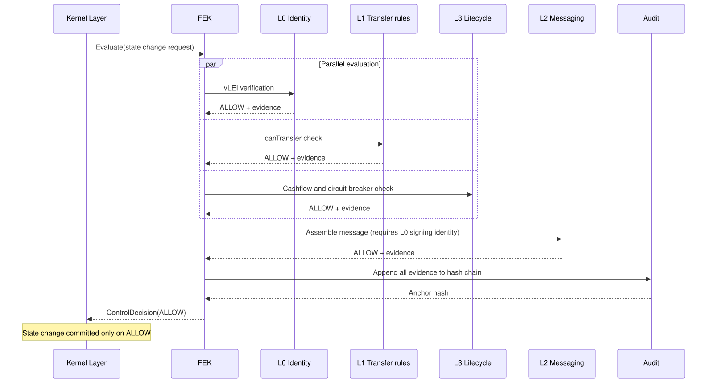

**Figure 4 — FEK parallel gate evaluation**

A DENY from any gate short-circuits the evaluation. Evidence from gates already reached is nevertheless written in full to the audit trail, so that the grounds for refusal can be examined later and cited in dispute resolution.

### 4.4 Substitution Matrix

| Gate | Default implementation | Alternative implementations | Applicable context |
|---|---|---|---|
| **L0 Identity** | vLEI / KERI / ACDC | X.509 + eIDAS certificates | EU institutions not yet using vLEI |
| | | ONCHAINID standalone | Pure on-chain, lightweight deployment |
| | | Canton Party ID | Canton Network deployment |
| | | National eID / commercial certificate | Local regulatory requirement |
| **L1 Transfer rules** | ERC-3643 + ONCHAINID | ERC-1400 | Existing ERC-1400 assets |
| | | Daml controller + choice | Canton, enforced at protocol layer |
| | | Hedera HTS KYC/Freeze Key | Hedera deployment |
| | | Stellar SEP-8 Regulated Assets | Stellar deployment |
| **L2 Messaging** | ISO 20022 | FpML | OTC derivatives |
| | | FIX | Pre-trade and execution |
| | | FINOS CDM | Collateral and derivatives workflows |
| **L3 Lifecycle** | **ACTUS** | **Deliberately none provided** | See 4.5 |
| **Audit** | SHA-256 hash chain | + ML-DSA-65 signature | Quantum-safe attestation |
| | | + Public chain anchoring | Third-party timestamping |

### 4.5 Why L3 Is Deliberately Fixed

Substitution at L0, L1 and L2 is a **deployment option**. L3 is different: it is the **provenance anchor**.

As Section 7 sets out, the entire basis of contract provenance is that on-chain execution logic can be cryptographically proven to originate from a signed version of an ACTUS term set. If L3 were substitutable, that chain of proof would break, since different deployments could adopt different lifecycle semantics.

L3 therefore retains the `Gate` interface for architectural consistency, but the ACTUS implementation is fixed in the FinanceVM compliance deployment profile. Substituting L3 must be declared as a downgrade and scored accordingly in self-assessment. **This immutability is a design position, not a capability limitation.**

---

## 5. Contract-Anchored Cross-Ledger Synchronisation

### 5.1 The Consistency Problem in a Sovereign Node Network

A sovereign node architecture explicitly rejects globally shared state. This delivers independence and regulatory controllability, but leaves a question that must be answered: if nodes do not share state, what keeps them consistent?

The conventional answer is a cross-chain bridge. Reconciling N ledgers pairwise requires N(N−1)/2 reconciliation relationships, each of which must handle differences in finality, timing and format. The result is both complex and fragile, and introduces double-counting risk through wrapped assets.

### 5.2 A Deterministic Anchor in Place of Pairwise Reconciliation


**Figure 5 — Contract-anchored cross-ledger synchronisation**

**The central proposition: ledgers do not reconcile against each other, but each against the same deterministic anchor.**

This is precisely the consistency mechanism a sovereign node network requires. It does not oblige nodes to share state; it obliges each node to answer to the same signed contract terms. Sovereignty is preserved.

### 5.3 Three Consequences

| Consequence | Detail |
|---|---|
| Complexity falls from O(N²) to O(N) | The marginal cost of adding a sovereign node is constant |
| Entitlement is determined by **contract time**, not wall-clock time | The ACTUS event schedule is defined by the contract and does not depend on any ledger's block time |
| No wrapped tokens, therefore no double counting | No asset is wrapped |

The second consequence merits expansion. A familiar difficulty is that tokenised rails settle close to real time while traditional rails follow batch schedules, so entitlement is determined at different moments on each. Under contract time the problem does not arise: coupon entitlement is fixed by the ACTUS record date, and when each ledger **observes** that event has no bearing on who is entitled. Observation lag becomes a reconciliation matter rather than an entitlement matter.

### 5.4 Statement of Scope

| | Resolved |
|:---:|---|
| ✅ | Cross-ledger entitlement consistency |
| ✅ | Cross-ledger terms consistency |
| ✅ | Cross-ledger reconciliation, each against the anchor |
| ✅ | Contract provenance |
| ❌ | **Atomicity of cross-ledger value transfer** |
| ❌ | Enforcement of cross-ledger uniqueness of asset location |

Contract anchoring resolves consistency of entitlement and terms. It **does not provide atomic cross-ledger value exchange**. In this reference implementation, atomic DvP is achieved within a single permissioned ledger, Hyperledger Besu.

**Cross-ledger atomic settlement is deliberately deferred**, pending clearer direction from regulators in each jurisdiction on public-chain participation. This is a regulatory judgement rather than a technical constraint. Building a cross-chain bridge while regulatory positions remain unsettled would place the platform operator within the category of market institutions requiring cross-jurisdictional licensing, materially altering the platform's regulatory standing.

---

## 6. Building Block #30: Accounting Recognition Interoperability

### 6.1 The State of the Standards and What It Implies for Architecture

The International Accounting Standards Board has not committed to a separate crypto-asset standard. It plans instead to update IAS 38 (Intangible Assets) to address the relevant questions, with the work scheduled on its official work plan for the second half of 2026. The Financial Accounting Standards Board has opened a project on crypto asset transfers, whose objectives include broadening the scope of Subtopic 350-60 and clarifying derecognition guidance for transfers, alongside a separate project examining whether certain digital assets may be classified as cash equivalents.

**This has a decisive implication for architecture: there is at present no standard available to hard-code.** Any system that fixes account categories in code will have to be rebuilt once the standards land.

A configurable mapping layer is therefore not an expedient. While the standards remain unsettled, it is the only correct architecture.

### 6.2 The Virtual General Ledger


**Figure 6 — Virtual General Ledger architecture**

The system **does not determine** classification. It executes the mapping the user has configured, and records the version and effective period of that configuration.

### 6.3 Data Model


**Figure 7 — Virtual General Ledger data model**

### 6.4 Scope of Classification Decisions

The user configures the classification outcome by jurisdiction, accounting framework, asset nature and holding purpose.

| Classification | Standard | Context |
|---|---|---|
| Inventory | IAS 2 | Held for sale by a dealer |
| Intangible asset | IAS 38 | Prevailing treatment under current IFRS |
| Financial instrument | IFRS 9 | Tokenised securities with debt or equity characteristics |
| Cash equivalent | Pending confirmation | If subsequently adopted by the standards |

Subsequent measurement is likewise configurable: cost model, revaluation model, FVTPL, or amortised cost.

### 6.5 Rule Versioning Is an Audit Requirement

Recognition rule sets are brought within contract version management (Section 7). When a standard is updated, the system must be able to demonstrate that transactions in 2026 were recognised under the rules then in force and transactions from 2027 under the new rules, and to reproduce both. Every journal entry records the rule-set version applied, so that any historical entry can be traced back to the rule and the ACTUS event that produced it.

### 6.6 The Argument

> "Same asset, same rights, same outcome" should not stop at settlement finality. If the same tokenised security is recognised under different account categories and measured on different bases across jurisdictions, then **the economic outcome is not the same**. Interoperability has failed at the level of the financial statements.

---

## 7. Building Block #31: Verifiable Contract Provenance

### 7.1 Required but Unsolved

Building block 19 of the industry framework expressly requires **verifiable contract provenance** and **controlled change**. The requirement is stated but no route to it is given, and under prevailing architectures none exists. Smart contracts are written and deployed by hand; no cryptographic link binds on-chain execution logic to the legal document.

### 7.2 The Provenance Chain

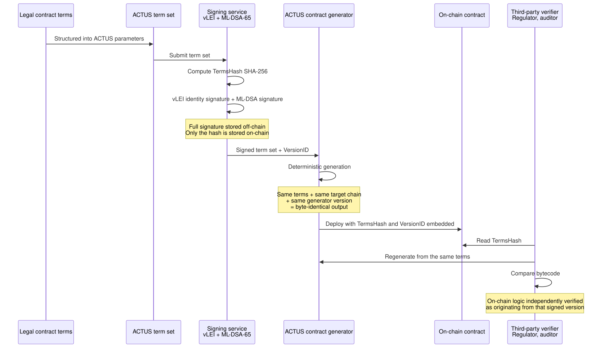

**Figure 8 — The provenance chain**

### 7.3 Version Lifecycle


**Figure 9 — Contract version state machine**

Version changes fall into four categories: regulatory requirement, corporate structure change, economic terms change, and technical upgrade. Regulatory changes carry the highest priority.

### 7.4 Four Requirements

1. **Deterministic generation.** Identical inputs produce a byte-identical contract, allowing a third party to reproduce and compare independently.
2. **Provenance anchor on chain.** The contract embeds TermsHash and VersionID. The full ML-DSA-65 signature (3,309 bytes) is held in an off-chain database; only the SHA-256 hash is stored on chain, containing on-chain storage cost.
3. **Sole upgrade authority.** Upgrade, freeze and retirement of an on-chain contract are accepted only under FinanceVM signature authorisation, and each change must cite a new term-set version that has passed FEK compliance checks.
4. **Cross-chain behavioural consistency.** Contracts generated from the same ACTUS terms on different ledgers must pass the same set of golden-number tests.

---

## 8. Building Block #32: Design-Intent Conformance and Multi-Viewpoint Internal Control

### 8.1 What Tokenisation Lacks Is Not Technology but Internal Control

Current tokenisation practice concentrates on whether a token can move correctly. Before a financial instrument enters the market, however, an institution must answer a different set of questions: **who is responsible for what, at which point can an intervention be made, and how would anyone know it had departed from its design?**

These are questions of internal control, not of technology. Tokenisation sharpens them, because once a token is circulating in secondary markets the issuer's visibility into its whereabouts is considerably lower than for a traditional security.

The industry framework addresses facets of this in BB7 (lifecycle roles), BB11 (account role responsibility), BB17 (intermediary responsibilities), BB22 (segregation of duties) and BB23 (data access roles). **No building block addresses the detection of deviation between design intent and actual state.** That is what this section proposes.

### 8.2 BPoS as a Structured Statement of Design Intent

ISO 21586 (BPoS) specifies how banking products and services are described. FinanceVM uses BPoS for more than classification: it serves as the **formal declaration of a token's design intent**.

| What BPoS describes | Function in internal control |
|---|---|
| Constituent elements of the product or service | Which rights and obligations the token should carry |
| Applicable conditions and restrictions | Transfer restrictions, investor eligibility, holding limits |
| Roles involved and their responsibilities | Who is issuer, underwriter, participant, custodian |
| Lifecycle stages | Primary issuance, listing, secondary circulation, maturity |
| Fee and pricing structure | The legitimate range of amounts receivable and payable |

A complete BPoS description is, in effect, the **control baseline** for that token.

### 8.3 Multi-Viewpoint State Visibility


**Figure 10 — Multi-viewpoint token state visibility**

**The governing principle: the seven viewpoints see different projections of one state, not seven separately maintained records.** Projection is determined by role permissions (corresponding to BB23), but the underlying facts are singular. This removes the root cause of the discrepancies between parties' records that characterise conventional architectures.

### 8.4 Detecting Risk Outside the Design Envelope

Risk outside the design envelope arises when a token's actual state falls into a range not contemplated at design time. The principal types are as follows.

| Type of deviation | Example | Basis for detection |
|---|---|---|
| Concentration | A single holder exceeds the design limit | BPoS holding limits |
| Eligibility | Tokens reach a non-eligible investor account | BPoS investor conditions + FEK L0/L1 |
| Lifecycle | A coupon due does not occur on the ACTUS scheduled date | ACTUS event schedule |
| Liquidity | Secondary-market volume diverges from design expectation | BPoS product characteristics |
| Structural | On-chain contract version differs from the EFFECTIVE version | Provenance module TermsHash |
| Segregation | One entity simultaneously holds incompatible roles | BPoS role definitions + BB22 |


**Figure 11 — Design-intent conformance state machine**

**Design philosophy.** A deviation is not presumed to be a breach. It may instead reveal a gap in the design itself, in which case the correct response is to amend the BPoS description and issue a new contract version rather than to suppress the signal. The `DESIGN_AMENDED` path gives the system a capacity to learn, not merely to raise alerts.

### 8.5 Primary and Secondary Markets

| | Primary market | Secondary market |
|---|---|---|
| Principal control points | Issuance conditions, placement eligibility, limits | Transfer restrictions, holder structure, concentration |
| Source of visibility | Underwriting process records | Ledger state + FEK audit trail |
| Typical deviations | Over-allotment, ineligible subscription | Eligibility drift, accumulating concentration |
| Means of enforcement | Underwriting agreement + FEK L1 | FEK L1 + L3 circuit breaker |

The difficulty in secondary markets is that the issuer loses direct visibility. Contract anchoring supplies the capability that matters here: **whichever sovereign node a token circulates to, its behaviour is bounded by the same ACTUS term set**. Deviation detection therefore does not rely on nodes reporting voluntarily.

---

## 9. Completed Sandbox Platforms and the Besu Reconstruction

### 9.1 Ten Classes of Token Platform Delivered on the v1.0 Architecture

| Platform | ACTUS contract type | Representative instrument |
|---|---|---|
| Deposit token | CSH / UMP | Demand and time deposits |
| Bond token | PAM / LAM / NAM / ANN | Fixed and floating rate bonds |
| Equity token | STK | Ordinary and preference shares |
| Futures token | FUTUR | Standardised futures contracts |
| Option token | OPTNS | Calls and puts |
| Collateral token | CEC | Collateral arrangements |
| Commodity token | COM | Physical commodity positions |
| Swap token | SWAPS / SWPPV | Interest rate and currency swaps |
| Annuity token | ANN | Annuity payment contracts |
| Guarantee token | CEG | Credit guarantees |

This range covers the principal contract-type families of the ACTUS standard, spanning cash, debt, equity, derivatives and credit enhancement. **It is the empirical case for the "one core, multiple packaging" principle**: a single ACTUS calculation core, packaged differently, supports instruments of widely differing character.

### 9.2 Two-Track Strategy

| | Showcase Track | Reference Track |
|---|---|---|
| Version designation | `v1.x — Sandbox` | `v2.0 — Reference Implementation` |
| Contents | The ten token sandbox platforms above | Platform rebuilt on Besu |
| Purpose | Demonstrating portability of the core across instrument classes | Formal engagement, regulatory dialogue, subject of assessment in this paper |

> **Statement.** The FinanceVM sandbox platforms (v1.x) are capability demonstrations, intended to show that a shared core is portable across ten classes of financial instrument. **They are not the subject of the capability assessment in this paper.** That assessment applies to the FinanceVM Reference Implementation (v2.0) on Hyperledger Besu. The ten platforms will be rebuilt on the Besu architecture in sequence.

### 9.3 Deployment Architecture


**Figure 12 — Besu reference implementation deployment**

The role of public chains is unchanged from version 1.0: **transparency and audit anchoring only. They do not carry asset state.**

### 9.4 Two Non-Negotiable Prerequisites in the Reconstruction Sequence

| Order | Item | Why it must sit here |
|:---:|---|---|
| 1 | Unified account and wallet model | Position, Instrument and the audit trail must all reference AccountID |
| 2 | Data privacy classification tagging | Which fields are PII and which stay off chain is a schema decision |
| 3 | Ownership level model | Necessary completion of the account model |
| 4 | Foundation and Kernel rebuild | Precision core, value objects, state machine, CFEP |
| 5 | FEK integration | Four gates, policy engine, audit |
| 6 | Provenance module | BB#31 |
| 7 | Contract version management | Shares TermsHash with item 6; the two must be built together |
| 8 | Recognition module | BB#30 |
| 9 | Conformance module | BB#32 |

Items 1 and 2 must precede item 4. Both are schema-layer decisions: once the Kernel is built and data begins reaching the chain, the cost of changing them moves from weeks to a rebuild.

### 9.5 Account Model


**Figure 13 — Account and ownership level model**

Without capability equivalent to omnibus, nominee and trust accounts, existing investment vehicles cannot enter a DLT platform, and liquidity suffers directly.

---

## 10. Standards Coverage

### 10.1 Identification and Reference Data Standards

| Standard | Content | Module |
|---|---|---|
| ISO 6166:2021 | ISIN, International Securities Identification Number | FOM |
| ISO 4914:2021 | UPI, Unique Product Identifier | FOM |
| ISO 23897:2020 | UTI, Unique Transaction Identifier | FOM |
| ISO 18774:2024 | FISN, Financial Instrument Short Name | FOM |
| ISO 24165 | DTI, Digital Token Identifier | FOM |
| ISO 10962:2021 | CFI, Classification of Financial Instruments | FOM |
| ISO 20275:2017 | ELF, Entity Legal Forms | FOM |
| **ISO 21586:2020** | **BPoS, description of banking products and services** | **BPoS module (control baseline)** |
| ISO 17442-3 | vLEI, verifiable Legal Entity Identifier | vLEI |
| FINOS CDM | Common Domain Model | FOM |

All nine identifier standards are implemented with their check-digit algorithms.

### 10.2 Execution, Messaging and Cryptographic Standards

| Standard | Module |
|---|---|
| ACTUS | ACTUS module — financial contract calculation, unified substrate |
| ISO 20022 | ISO 20022 module — full message catalogue |
| ERC-3643 + ONCHAINID | FEK L1 default implementation |
| NIST FIPS 203 (ML-KEM-768) | PQC module — post-quantum key encapsulation |
| NIST FIPS 204 (ML-DSA-65) | PQC module — post-quantum digital signature |
| BCBS SCO 60 | BCBS SCO 60 module — LCR / NSFR |

**Scope of post-quantum claims.** The module implements the FIPS 203/204 algorithms but has not yet been certified. Until certification is complete, this paper makes no claim of post-quantum compliance and states only the implementation status of the algorithms.

---

## 11. Assessment Methodology and Commitment

This paper presents **no numerical capability self-assessment scores**.

The FinanceVM Reference Implementation is under reconstruction. Scores published against an architecture scheduled for replacement would mislead.

On completion, a full self-assessment across all **32 building blocks** will be published on the 0–4 scale defined by the industry framework, with the evidence each level requires.

| Score | Label | Evidence required |
|:---:|---|---|
| 0 | Not Addressed | — |
| 1 | Partially Addressed | Internal discussion documents or preliminary design sketches |
| 2 | Planned | Approved project plan, architecture document or roadmap item |
| 3 | Implemented | Working code, deployed service or documented operating procedure |
| 4 | Verified & Compliant | Test reports, audit results, regulatory approval or industry certification |

---

## 12. Roadmap

| Status | Item |
|:---:|---|
| **Delivered** | Precision core (arbitrary-precision arithmetic, no floating-point error) |
| | ACTUS module (production) |
| | ISO 20022 module (production) |
| | vLEI module, operating on the GLEIF test network |
| | BCBS SCO 60 module (production) |
| | PQC module (pending certification) |
| | FEK module |
| | Sandbox platforms for ten classes of financial instrument |
| **In progress** | Besu reference implementation reconstruction |
| | Unified account and wallet model, data privacy classification |
| | FEK pluggable gate interface |
| **Planned** | Provenance module (#31) |
| | Recognition module (#30) |
| | Conformance module (#32) |
| | Contract version management |
| | Canton Network / Daml integration |
| **Deliberately deferred** | Cross-ledger atomic settlement, pending clearer regulatory direction on public-chain participation in each jurisdiction |

---

## Appendix A — Reconciling the Layer Models

FEK's L0–L3 and the FinanceVM layers are **two orthogonal dimensions**.

| Dimension | Nature | Meaning of the sequence |
|---|---|---|
| FinanceVM named layers | Architectural layering | Direction of dependency: upper layers depend on lower |
| FEK L0–L3 | Control gates | Order of execution: identity → transfer rules → messaging → lifecycle |


**Figure 14 — The two orthogonal dimensions**

---

## Appendix B — Changes from v1.0 to v2.0

| Aspect | v1.0 | v2.0 |
|---|---|---|
| Precision core | Established | Unchanged |
| Sovereign execution environment | Established | Unchanged |
| Network of sovereign nodes | Position established | **Consistency mechanism supplied (contract anchoring)** |
| FOM | FINOS CDM + ISO 4914 | Extended to nine identifier standards |
| Audit layer | Public chain for anchoring only | Unchanged |
| BPoS | Used for classification | **Elevated to control baseline (#32)** |
| Compliance control | Distributed across modules | **Consolidated into the FEK module** |
| Accounting recognition | Not covered | **Added (#30)** |
| Contract provenance | Not covered | **Added (#31)** |
| Inter-node communication | Model Context Protocol | Inter-Node Settlement Protocol (see Appendix C) |

---

## Appendix C — Nomenclature

Version 1.0 used "Model Context Protocol (MCP)" for the communication protocol between sovereign nodes. That name is now widely used for an unrelated AI tooling protocol and would be liable to confuse readers in 2026. Version 2.0 adopts the unambiguous name **Inter-Node Settlement Protocol (INSP)**.

---

## Appendix D — Index of Figures

| Figure | Title | Type | Section |
|:---:|---|---|:---:|
| 1 | FinanceVM module relationships | Component | 3.1 |
| 2 | FinanceVM layered architecture | Component | 3.2 |
| 3 | FEK gate interface and implementations | Class | 4.2 |
| 4 | FEK parallel gate evaluation | Sequence | 4.3 |
| 5 | Contract-anchored cross-ledger synchronisation | Flow | 5.2 |
| 6 | Virtual General Ledger architecture | Flow | 6.2 |
| 7 | Virtual General Ledger data model | Class | 6.3 |
| 8 | The provenance chain | Sequence | 7.2 |
| 9 | Contract version state machine | State | 7.3 |
| 10 | Multi-viewpoint token state visibility | Flow | 8.3 |
| 11 | Design-intent conformance state machine | State | 8.4 |
| 12 | Besu reference implementation deployment | Deployment | 9.3 |
| 13 | Account and ownership level model | Class | 9.5 |
| 14 | The two orthogonal dimensions | Comparison | Appendix A |
